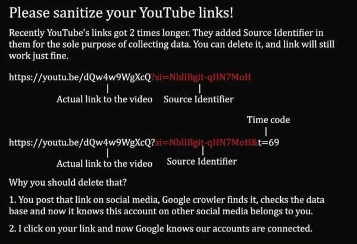

# url-sanitizer




<br>

`url-sanitizer` is a Rust command-line tool designed to process and sanitize URLs, removing unwanted parameters or formatting them for safe use. This tool is lightweight, fast, and built for reliability.


## Features
- Sanitizes URLs (e.g., removes tracking parameters or normalizes formats).
- Fast execution with Rust's performance.
- Portable, statically linked binary for easy distribution.

## Prerequisites - be Sure to have  musl-tools
To build and install `url-sanitizer` on a Debian system, ensure the following are installed:
- **Rust and Cargo**: The Rust toolchain.
  ```bash
  curl --proto '=https' --tlsv1.2 -sSf https://sh.rustup.rs | sh
  source $HOME/.cargo/env
  ```
- **musl-tools**: For static linking with the `musl` target.
  ```bash
  sudo apt update
  sudo apt install musl-tools
  ```
- **Git**: To clone the repository (optional if you have the local codebase).
  ```bash
  sudo apt install git
  ```

Verify installations:
  ```bash
  rustc --version && cargo --version && git --version
  ```

<br>


## Building a Standalone Binary
Follow these steps to build a **statically linked** binary, which can run on any
x86_64 Linux system without external library dependencies.


1. **Clone the repository:**
  ```bash
   # http git clone
   git clone https://github.com/LinuxUser255/url-sanitizer.git

   cd url-sanitizer
  ```

<br>

2. **Add the `musl` Target**:
   ```bash
   rustup target add x86_64-unknown-linux-musl
   ```

<br>

3. **Build the Static Binary**:
   Compile in release mode for an optimized, standalone binary:
   ```bash
   cargo build --release --target x86_64-unknown-linux-musl
   ```
   The binary will be at `target/x86_64-unknown-linux-musl/release/url-sanitizer`.


<br>

4. **Verify Static Linking**:
   Ensure the binary has no dynamic dependencies:
   ```bash
   ldd target/x86_64-unknown-linux-musl/release/url-sanitizer
   ```
   Expected output: `statically linked` or `not a dynamic executable`.


<br>

5. **Optional: Strip the Binary**:
   Reduce binary size by removing debug symbols:
   ```bash
   strip target/x86_64-unknown-linux-musl/release/url-sanitizer
   ```

<br>

6. **Install Globally**:
   Move the binary to `/usr/local/bin` for system-wide access:
   ```bash
   sudo mv target/x86_64-unknown-linux-musl/release/url-sanitizer /usr/local/bin/
   ```
   Verify it’s accessible:
   ```bash
   which url-sanitizer
   ```

<br>

7. **Test the Binary**:
   Run the tool to ensure it works:
   ```bash
   url-sanitizer --help
   ```
   (Replace `--help` with appropriate arguments if your CLI requires them.)


<br>


## Usage
```bash
➜  ~ url-sanitizer -h
Usage: url-sanitizer --url <URL>

Options:
  -u, --url <URL>
  -h, --help       Print help
  -V, --version    Print version

```

## Example:
```bash

url-sanitizer --url https://youtu.be/gW464nWLdAs\?si\=TAZ3qCA1503uB__t
Sanitized URL: https://youtu.be/gW464nWLdAs

```

<br>


